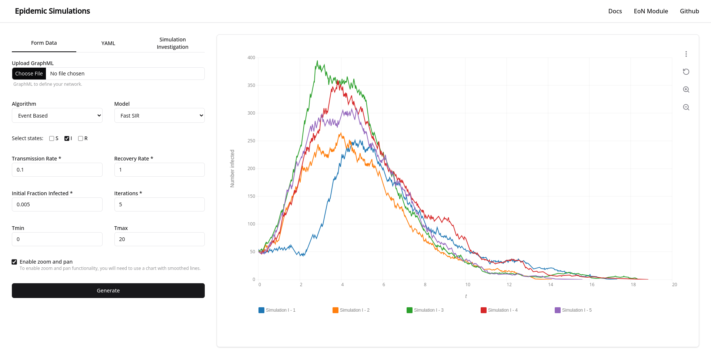

# Epidemics Simulations

Epidemics Simulations is a web application that allows you to create and visualize epidemics on networks. The application is built using SvelteKit as a Static Site Generator (SSG) for the frontend and Flask as the backend web server.

## Requirements

Ensure you have the following prerequisites installed on your system:

- Python 3.9 - 3.10
- pnpm

## Installation

Clone the repository

```sh
git clone https://github.com/victormhp/epidemics-sveltekit-flask.git
```

Navigate to the project directory

```sh
cd epidemics-sveltkit-flask.git
```

Run the build script

```sh
chmod +x build.sh
./build.sh
```

## EoN Module

The simulations are made possible by [EoN](https://github.com/springer-math/Mathematics-of-Epidemics-on-Networks), a Python package designed for simulating epidemics on networks and solving Ordinary Differential Equation (ODE) models of disease spread.

For more details on using the EoN module, refer to the [Epidemics on Networks Documenation](https://epidemicsonnetworks.readthedocs.io/en/latest/EoN.html). It provides comprehensive information on utilizing the EoN package.
