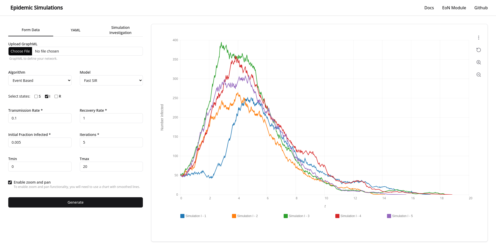

# Epidemics Simulations

Epidemics Simulations is a web application that allows you to create and visualize epidemics on networks. The application is built using Svelte for the frontend and Flask as the backend web server.

## Requirements

Ensure you have the following prerequisites installed on your system:

- Python 3.9 - 3.10
- pnpm
- Chromium (Only for desktop app)

## Installation

Clone the repository and navigate to the directory

```sh
git clone https://github.com/victormhp/epidemics-simulations.git
cd epidemics-simulations.git
```

### Option 1: Manually

```sh
# Install and build frontend
cd ./client/
pnpm install
pnpm run build


# Create and activate venv
cd ./server/
python3 -m venv venv
source ./venv/bin/activate

# Install python libraries
pip install -r requirements.txt
```

Run the flask server for developement

```sh
python index.py
```

Run for production with gunicorn

```sh
gunicorn --bind 0.0.0.0:8997 --timeout 600 wsgi:app
```

### Option 2: Docker

For a convenient and containerized deployment, you can use Docker.

Build docker image for the API

```sh
docker build -f Dockerfile.api -t eon-api .
```

Build docker image for the client and the nginx server

```sh
docker build -f Dockerfile.client -t eon-client .
```

Run docker compose to orchestrate the containers

```sh
docker compose up
```

## Desktop App

To run the desktop app, it will be built using [FlaskWebGui](https://github.com/ClimenteA/flaskwebgui). Please ensure that Google Chrome or Chromium is installed on your system.

```sh
python desktop.py
```

## Executable for Desktop App

To create an executable for the desktop app, we utilize [PyInstaller](https://github.com/pyinstaller/pyinstaller). You have two options to build the app:

```sh
chmod +x desktop.sh
./desktop.sh
```

**Note**: In the --add-data argument the path separator is platform specific, os.pathsep (which is ; on Windows and : on most unix systems) is used.

Run the app

```sh
./app/dist/epidemics
```

## EoN Module

The simulations are made possible by [EoN](https://github.com/springer-math/Mathematics-of-Epidemics-on-Networks), a Python package designed for simulating epidemics on networks and solving Ordinary Differential Equation (ODE) models of disease spread.

For more details on using the EoN module, refer to the [Epidemics on Networks Documenation](https://epidemicsonnetworks.readthedocs.io/en/latest/EoN.html). It provides comprehensive information on utilizing the EoN package.
